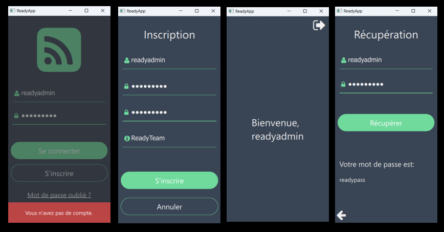
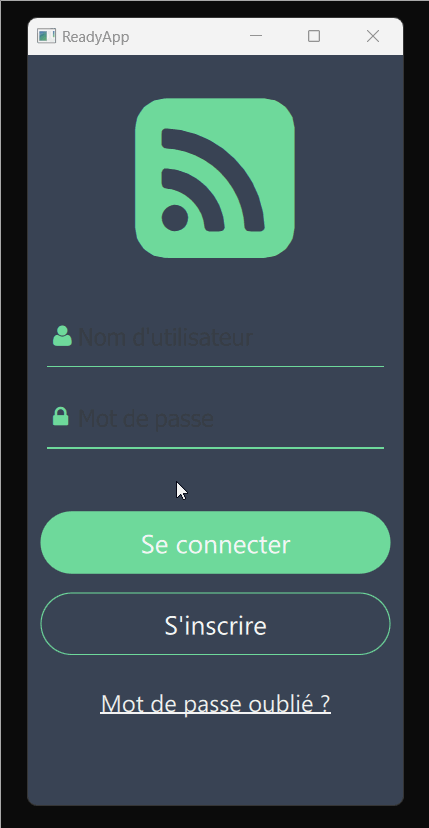

# Introduction

Le but de ce tutoriel est de vous apprendre à créer une application mobile Android - iOS 
en C++ - Qt - QML - JS pour la gestion d'un système de connexion et d'inscription de nouveaux utilisateurs.

# Résumé

# Demos

